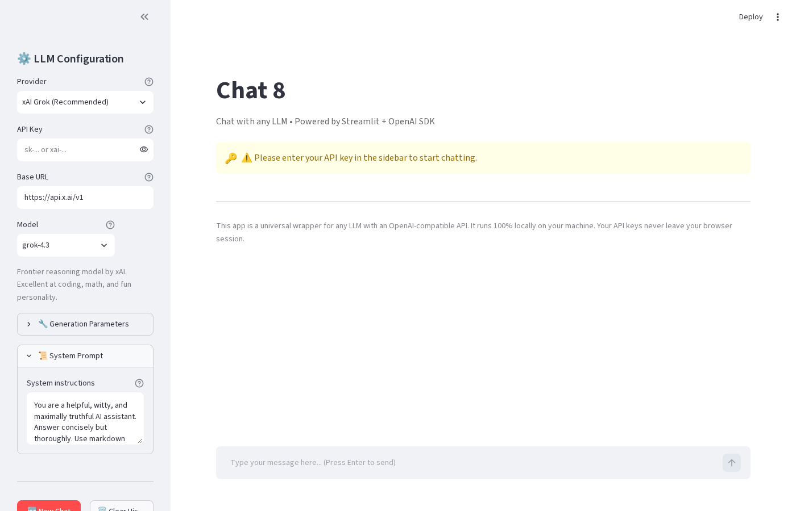
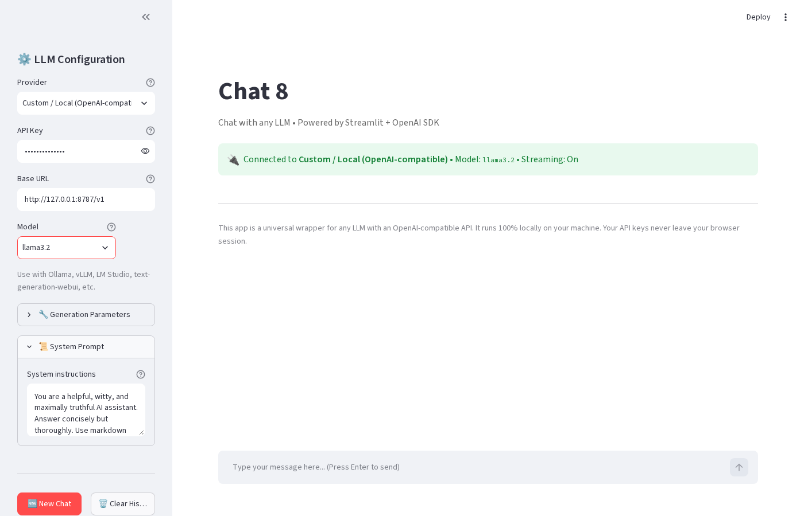
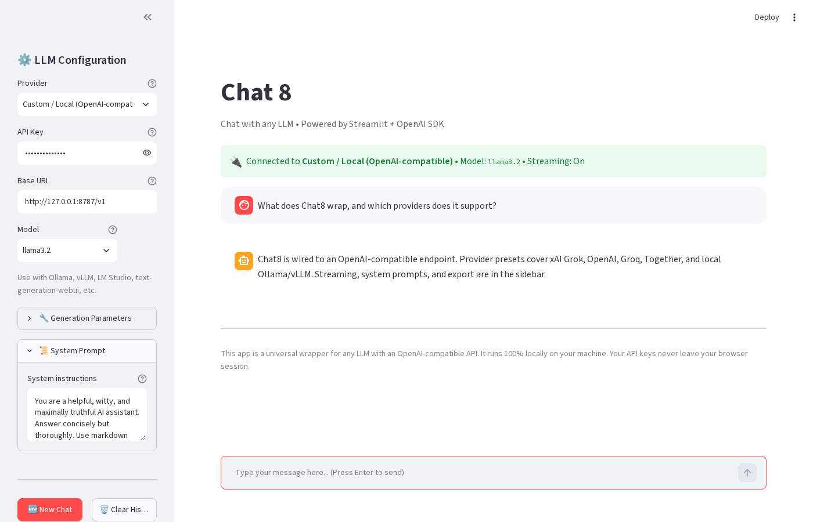

# Chat8 - OpenAI-compatible LLM chat (Streamlit)

A local Streamlit chat app that wraps any **OpenAI-compatible** LLM API (xAI Grok, OpenAI, Groq, Together.ai, Ollama, vLLM, LM Studio, or a custom base URL).

## Demo

Captured from a live local run on 2026-09-29 (America/New_York). The chat turn used a local OpenAI-compatible mock at `127.0.0.1:8787` so the UI path is real without shipping API keys.







## Features
- Connect to **xAI Grok**, OpenAI, Groq, Together.ai, Ollama (local), vLLM, or any OpenAI-compatible endpoint
- Modern chat interface with streaming responses
- Configurable: model, temperature, max tokens, system prompt, top_p
- Conversation history with session state
- Clean UI with sidebar settings, clear chat, export chat
- API key handled in-session only (password input)
- Presets for popular providers plus fully custom base URL

## Quick Start

### 1. Install dependencies
```bash
pip install -r requirements.txt
```

### 2. Get API Keys
- **xAI Grok**: https://console.x.ai/
- **OpenAI**: https://platform.openai.com/api-keys
- **Groq**: https://console.groq.com/keys
- **Together.ai**, Fireworks, etc. for open models

### 3. Run the app
```bash
streamlit run app.py
```

The app opens at `http://localhost:8501`.

## How to Use
1. Open the **Sidebar**
2. Select your **Provider** (xAI Grok is default)
3. Paste your **API Key**
4. Choose or type the **Model** name
5. (Optional) Set System Prompt, Temperature, Max Tokens
6. Start chatting
7. Use **Clear Chat** / **New Chat** to reset

## Supported Providers (Examples)

| Provider       | Base URL                              | Example Models                  | Notes                     |
|----------------|---------------------------------------|---------------------------------|---------------------------|
| xAI Grok       | `https://api.x.ai/v1`                 | `grok-4.3`, `grok-build-0.1`   | Reasoning and coding      |
| OpenAI         | `https://api.openai.com/v1`           | `gpt-4o`, `gpt-4o-mini`        | Industry standard         |
| Groq           | `https://api.groq.com/openai/v1`      | `llama-3.3-70b-versatile`      | Fast inference            |
| Custom         | Your endpoint                         | Any model                      | Ollama, vLLM, LM Studio   |

## Tips
- For **local models**: Use Ollama with `http://localhost:11434/v1` as base URL and a model like `llama3.2`
- Enable **Streaming** for token-by-token responses (default: on)
- Settings persist for the current browser session
- Export chat history as JSON or Markdown from the sidebar

## Advanced
You can extend this app:
- File uploads for RAG (LangChain or LlamaIndex)
- Tools / function calling
- Image upload for vision models
- Deploy to Streamlit Cloud, Hugging Face Spaces, or your own host

Streamlit + OpenAI SDK (compatible layer)

*Note: This is a local app. Never share your API keys. For production, add authentication.*
